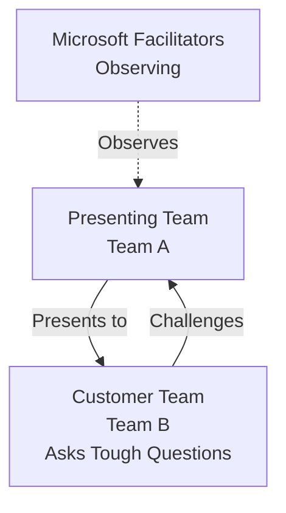

# Hackathon Content Transformation Guidelines

Transform hackathon content from prescriptive training into challenge-based, coaching-driven learning
experiences that emphasize prompt engineering, business context, and guided discovery.

## Core Philosophy

- **Coaching over Training**: Teach participants to ask better questions, not follow scripts
- **Business-First Framing**: Solutions must address business needs, not just technical requirements
- **Prompt Engineering Focus**: Teach effective AI agent interaction patterns
- **Guided Discovery**: Provide guidance and snippets, never complete solutions

## Transformation Principles

### 1. Shift from Training to Coaching

**Avoid (Training Pattern)**:

```markdown
Step 1: Invoke the plan agent
Step 2: Paste this prompt: "I need to plan Azure infrastructure..."
Step 3: Answer these specific questions with these specific answers
```

**Use (Coaching Pattern)**:

```markdown
Your Challenge: Use the plan agent to capture requirements for FreshConnect.

Consider:

- What information does the agent need to provide useful recommendations?
- How can you frame your business context to get better technical suggestions?

Guiding Questions:

- Q: "How do I know if my prompt has enough context?"
- A: "What would YOU need to know to design this infrastructure? Did you tell the agent?"
```

### 2. Replace Answers with Questions

**Avoid**:

```markdown
| Question    | Suggested Answer |
| ----------- | ---------------- |
| SLA target? | 99.9%            |
```

**Use**:

```markdown
When the agent asks about SLA targets, consider:

- What does "99.9%" availability actually mean in business terms?
- What's the cost difference between 99.9% and 99.99%?
- Does your budget support your availability target?

💡 Hint: Use the architect agent to explore trade-offs
```

### 3. Frame with Business Context

**Avoid**:

```markdown
Generate Bicep templates for Azure SQL, App Service, and Storage
```

**Use**:

```markdown
The Business Challenge:
Nordic Fresh Foods needs infrastructure to support 500+ restaurants and 10,000 consumers.
Peak load: 500 concurrent users during summer and December holidays.

Your Task:
How would you prompt the bicep-code agent to generate infrastructure that:

1. Handles these business requirements?
2. Stays within budget constraints?
3. Meets GDPR compliance needs?

What context does the agent need to make good technical choices?
```

### 4. Provide Snippets, Not Solutions

**Avoid (Complete Implementation)**:

```bicep
resource sqlGeoReplica 'Microsoft.Sql/servers@2023-05-01-preview' = if (enableDR) {
  name: 'sql-${projectName}-${environment}-gwc'
  location: secondaryLocation
  properties: {
    administratorLogin: sqlAdminLogin
    azureADOnlyAuthentication: true
  }
}
```

**Use (Conceptual Snippet)**:

```bicep
// Concept: DR requires a secondary SQL server and geo-replicated database

// Key parameters you'll need:
param primaryLocation string = 'swedencentral'
param secondaryLocation string = '?' // What region makes sense for DR?
param enableDR bool = true

// Research:
// - How do you create a SQL server in the secondary region?
// - What createMode enables geo-replication?

💡 Prompt engineering tip: Ask the bicep-code agent to "add geo-replication
   for disaster recovery" and let it generate the pattern.
```

### 5. Require Explanation, Not Just Execution

Attendees must explain their process with artifacts like Mermaid flowcharts:

```markdown
After the bicep-code agent generates templates:

1. Run bicep build and bicep lint
2. **Create a Mermaid flowchart** showing:
   - What happens during validation
   - What bicep lint checks for
   - How the deploy agent handles errors

Your flowchart demonstrates understanding of the workflow, not just execution.
```

## Coaching Phrases

Use these patterns when writing facilitator guidance:

| Avoid (Giving Answers)                          | Use (Guiding Questions)                                                      |
| ----------------------------------------------- | ---------------------------------------------------------------------------- |
| "You need to add `minimumTlsVersion: 'TLS1_2'`" | "What security policy is failing? What's the error message telling you?"     |
| "The answer is 99.9% SLA"                       | "What SLA does your budget support? What's the business impact of downtime?" |
| "Here's the Bicep code for geo-replication"     | "How would you describe what you need to the bicep-code agent?"              |
| "Use App Service Plan P1v3"                     | "What SKU features do you need? How does zone redundancy affect cost?"       |

## Challenge Structure Template

Each challenge should follow this structure:

```markdown
# Challenge X: [Title]

> **Duration**: X minutes | **Agent**: [agent-name] | **Output**: [expected artifacts]

## The Business Context

[Frame the challenge from a business perspective]

## Your Challenge

[Clear statement of what they need to accomplish]

## Consider

- [Guiding question 1]
- [Guiding question 2]
- [Guiding question 3]

## Required Deliverables

- [ ] [Specific artifact 1]
- [ ] [Specific artifact 2]

## Success Criteria

[How they know they've succeeded - without giving away the answer]
```

## Diagram Requirements

- Use Mermaid diagrams instead of ASCII art
- Require participants to create explanatory flowcharts
- Diagrams should demonstrate understanding, not just document results

**Example Mermaid Pattern**:



## Required Elements Per Challenge

1. **Business context framing** - Why does this matter to the customer?
2. **Guiding questions** - What should they think about?
3. **Prompt engineering tips** - How to interact effectively with agents
4. **Deliverable requirements** - What artifacts demonstrate understanding?
5. **ADR requirement** (where applicable) - Document architectural decisions

## Quality Checklist

Before finalizing any hackathon content:

- [ ] No complete solutions provided
- [ ] Business context clearly stated
- [ ] Guiding questions replace answer tables
- [ ] Mermaid diagrams used (not ASCII)
- [ ] Explanation requirements included
- [ ] Coaching language used throughout
- [ ] Prompt engineering patterns demonstrated
