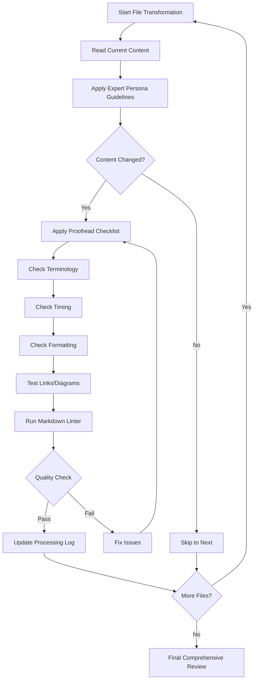

# Integrated Refactoring Workflow

## Overview

This document explains how the expert persona refactoring prompt and the proofread prompt work
together to ensure high-quality, consistent hackathon content transformation.

## Two-Phase Approach

### Phase A: Content Transformation

**Prompt**: `.github/prompts/expert-persona-hackathon-refactor.prompt.md`
**Persona**: Dr. Elena Björkström (Principal Learning Experience Designer)

**Purpose**: Transform content from workshop-style to challenge-based coaching approach

**Actions**:

- Remove complete solutions, provide snippets/concepts
- Replace prescriptive steps with guiding questions
- Add business context framing
- Create new documentation and diagnose challenges
- Update timing to 6-hour schedule
- Convert ASCII to Mermaid diagrams

### Phase B: Quality Assurance

**Prompt**: `.github/prompts/proofread-hackathon.prompt.md`
**Persona**: Master Technical Editor

**Purpose**: Ensure consistency, clarity, and professional quality

**Actions**:

- Fix spelling and grammar
- Verify terminology consistency
- Validate timing across all files
- Check formatting standards
- Test cross-references and links
- Run markdown linter

## Integrated Workflow

## File-by-File Process

For each file transformation:

### Step 1: Transform Content (Expert Persona)

Apply transformation guidelines:

- [ ] Remove complete solutions
- [ ] Add guiding questions
- [ ] Reframe with business context
- [ ] Update to coaching tone
- [ ] Add new challenges (if applicable)
- [ ] Convert diagrams to Mermaid

### Step 2: Immediate Proofread (Technical Editor)

Apply quality checks:

- [ ] Terminology: hackathon, challenge-based, coach (not workshop, training, instructor)
- [ ] Timing: Matches new 6-hour schedule
- [ ] Service names: GitHub Copilot, Nordic Fresh Foods, FreshConnect
- [ ] Agent references: `plan` agent (with backticks)
- [ ] Tables properly formatted
- [ ] Code blocks have language identifiers
- [ ] Mermaid diagrams render correctly
- [ ] Cross-references work

### Step 3: Validation

- [ ] Run `npm run lint:md` on changed file
- [ ] Test all links
- [ ] Verify Mermaid rendering
- [ ] Update Copilot-Processing.md task status

### Step 4: Commit

- [ ] Make descriptive commit message
- [ ] Reference challenge/file in commit

## Quality Gates

### Per-File Gates

Before marking any file complete:

- ✅ Content transformed per expert persona guidelines
- ✅ Proofreading checklist completed
- ✅ Markdown lints clean
- ✅ All diagrams render
- ✅ Processing log updated

### Phase Gates

Before moving to next phase:

- ✅ All files in current phase complete
- ✅ Cross-file consistency verified
- ✅ Timing alignment checked
- ✅ No broken cross-references

### Final Gate

Before marking project complete:

- ✅ Comprehensive proofread pass across ALL files
- ✅ Terminology consistent everywhere
- ✅ Timing consistent everywhere
- ✅ All Mermaid diagrams tested
- ✅ Full markdown lint passes
- ✅ All challenges reference correct agents
- ✅ No complete solutions remain
- ✅ Coaching tone throughout

## Key Terminology Mappings

When transforming content, ensure these updates:

| Old (Workshop)        | New (Hackathon)                          | Context                       |
| --------------------- | ---------------------------------------- | ----------------------------- |
| workshop              | hackathon                                | Event type                    |
| instructor, trainer   | coach, facilitator                       | Role                          |
| workshop-style        | challenge-based                          | Format                        |
| 5 hours               | 6 hours                                  | Duration                      |
| 10:00 start           | 09:00 start                              | Schedule                      |
| Step 1: Do X          | Consider: What would happen if...?       | Tone                          |
| Here's the answer     | What questions would help you find this? | Approach                      |
| Complete code example | Conceptual snippet + prompt tip          | Solutions                     |
| 6 challenges          | 8 challenges                             | Count (added docs + diagnose) |

## Timing Updates

Update all references from old to new schedule:

| Challenge  | Old Time    | New Time    | Duration Change |
| ---------- | ----------- | ----------- | --------------- |
| Intro      | 10:00-10:30 | 09:00-09:30 | Same (30 min)   |
| C1         | 10:30-11:15 | 09:30-10:20 | 45→50 min       |
| C2         | 11:15-12:00 | 10:20-11:10 | 45→50 min       |
| Lunch      | 12:00-12:35 | 11:10-11:40 | 35→30 min       |
| C3         | 12:35-13:20 | 11:40-12:40 | 45→60 min       |
| C4         | 13:20-13:40 | 12:40-13:10 | 20→30 min       |
| C5         | 13:40-14:00 | 13:10-13:30 | 20 min          |
| C6 (NEW 7) | -           | 13:30-13:50 | 20 min (new)    |
| C7 (NEW 8) | -           | 13:50-14:00 | 10 min (new)    |
| Prep       | 14:00-14:15 | 14:00-14:15 | Same (15 min)   |
| C8 (was 6) | 14:15-14:55 | 14:15-14:55 | Same (40 min)   |
| Wrap       | 14:55-15:00 | 14:55-15:00 | Same (5 min)    |

## Critical Checks

### Terminology Audit

Search and replace these across ALL files:

- "workshop" → "hackathon" (when referring to this event)
- "instructor" → "coach" or "facilitator"
- "student" → "attendee" or "participant"
- "training" → "coaching" (in context of approach)
- "Workshop" in titles → "Hackathon"

### Timing Audit

Verify these time references are updated:

- Start time: 10:00 → 09:00
- Challenge 1 end: 11:15 → 10:20
- Challenge 2 end: 12:00 → 11:10
- Lunch period: 12:00-12:35 → 11:10-11:40
- Any other specific time mentions

### Agent Reference Audit

Ensure proper formatting:

- `plan` agent (with backticks)
- `architect` agent
- `bicep-plan` agent
- `bicep-code` agent
- `deploy` agent
- `docs` agent (newly referenced)
- `diagnose` agent (newly referenced)

## Success Metrics

The refactoring is successful when:

✅ **Tone**: 100% coaching, 0% prescriptive training
✅ **Solutions**: Only snippets/concepts, no complete implementations
✅ **Questions**: Every former "answer" becomes a guiding question
✅ **Business Context**: All challenges framed with business driver first
✅ **Consistency**: All terminology, timing, and formatting aligned
✅ **Quality**: All files pass markdown lint
✅ **Completeness**: All 8 challenges documented
✅ **Timing**: 6-hour schedule verified across all files

## Reference Files

| Purpose                | File                                                          |
| ---------------------- | ------------------------------------------------------------- |
| Content Transformation | `.github/prompts/expert-persona-hackathon-refactor.prompt.md` |
| Quality Assurance      | `.github/prompts/proofread-hackathon.prompt.md`               |
| Progress Tracking      | `Copilot-Processing.md`                                       |
| Timing Source of Truth | `hackathon/AGENDA.md` (to be updated first)                   |

## Usage

When beginning work:

1. Read both prompt files completely
2. Review Copilot-Processing.md for current status
3. For each file:
   - Apply expert persona transformation
   - Immediately apply proofread checklist
   - Update processing log
4. After each phase, verify cross-file consistency
5. Before final commit, run comprehensive proofread across all files
