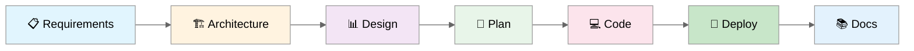
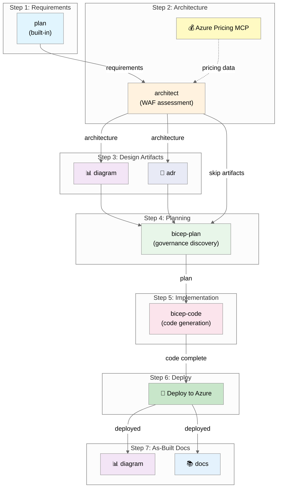

# 🤖 Agentic InfraOps Workshop

<div align="center">

**Azure infrastructure engineered by AI agents. Verified. Well-Architected. Deployable.**

[](LICENSE)
[](VERSION.md)
[](https://azure.microsoft.com)
[](https://github.com/features/copilot)
[](https://learn.microsoft.com/azure/azure-resource-manager/bicep/)
[](https://conventionalcommits.org)

[Get Started](#-quick-start) • [Hackathon](#-hackathon) • [Workflow](#-workflow) • [Documentation](#-documentation)

</div>

---

## ✨ What's Inside

<table>
<tr>
<td width="50%">

### 🎯 Custom Copilot Agents

8 specialized agents for the full infrastructure lifecycle:

- **plan** → Requirements gathering
- **architect** → WAF assessment
- **bicep-plan** → Implementation planning
- **bicep-code** → Code generation
- **deploy** → Azure deployment
- **diagram** → Architecture diagrams
- **docs** → Documentation generation
- **diagnose** → Workload diagnostics

</td>
<td width="50%">

### 🛠️ Ready-to-Use Tools

Everything pre-configured in a Dev Container:

- **Azure Pricing MCP** → Real-time cost estimates
- **Bicep** → Infrastructure as Code
- **Azure CLI** → Cloud management
- **PowerShell 7** → Automation scripts
- **Markdown linting** → Documentation quality

</td>
</tr>
<tr>
<td width="50%">

### 📐 Well-Architected Framework

Every decision aligned with Azure WAF:

- ⚡ **Reliability** → SLA, RTO, RPO
- 🔒 **Security** → Zero-trust, encryption
- 💰 **Cost** → Optimization, budgets
- 🔧 **Operations** → Monitoring, IaC
- 🚀 **Performance** → Scalability, efficiency

</td>
<td width="50%">

### 📚 Complete Learning Path

From zero to deployed infrastructure:

- Step-by-step workflow guide
- Reusable prompt templates
- Artifact templates
- Best practices documentation
- **NEW: 5-hour hands-on hackathon!**

</td>
</tr>
</table>

---

## 🎓 Hackathon

<table>
<tr>
<td>

### 🏆 4-Hour Hands-On Challenge

Transform business requirements into deployed Azure infrastructure using AI agents.

**Perfect for:**

- IT Pros familiar with Azure Portal, new to IaC
- Teams of 3-4 (20-24 participants total)
- Workshop facilitators and trainers

**Includes:**

- 5 progressive challenges with a surprise "curveball"
- Automated scoring aligned with WAF pillars
- Facilitator guide with curveball announcement script
- Quick reference cards and team role definitions

</td>
<td width="40%">

```
hackathon/
├── challenges/        # 5 challenge files
├── participant/       # Scenario, hints, cards
├── facilitator/       # Guide, scoring, solutions
└── feedback-form.md   # Post-event survey

scripts/hackathon/
├── Score-Team.ps1
├── Get-Leaderboard.ps1
└── Cleanup-HackathonResources.ps1
```

**[→ Start the Hackathon](hackathon/README.md)**

</td>
</tr>
</table>

---

## 🚀 Quick Start

### Prerequisites

| Requirement              | Purpose                   |
| ------------------------ | ------------------------- |
| Docker Desktop           | Dev Container runtime     |
| VS Code + Dev Containers | Development environment   |
| GitHub Copilot           | AI-powered agents         |
| Azure subscription       | Infrastructure deployment |

### Setup (5 minutes)

```bash
# 1. Clone and open
git clone https://github.com/jonathan-vella/azure-agentic-infraops-workshop.git
cd azure-agentic-infraops-workshop
code .

# 2. Reopen in Dev Container (F1 → "Dev Containers: Reopen in Container")

# 3. Authenticate
az login
az account set --subscription "<your-subscription-id>"

# 4. Verify
az account show --query name -o tsv && bicep --version
```

---

## 🔄 Workflow

**7 steps from requirements to deployed infrastructure:**



| Step | Agent          | Output                          | Required |
| ---- | -------------- | ------------------------------- | -------- |
| 1    | **plan**       | `01-requirements.md`            | ✅       |
| 2    | **architect**  | `02-architecture-assessment.md` | ✅       |
| 3    | **diagram**    | `03-des-*.md` / `03-des-*.png`  | Optional |
| 4    | **bicep-plan** | `04-implementation-plan.md`     | ✅       |
| 5    | **bicep-code** | `infra/bicep/{project}/`        | ✅       |
| 6    | **deploy**     | `06-deployment-summary.md`      | ✅       |
| 7    | **docs**       | `07-*.md`                       | Optional |

**Usage:** `Ctrl+Alt+I` → `Ctrl+Shift+I` to switch to Agent mode → Select agent from dropdown

<details>
<summary>📊 Detailed Workflow Diagram</summary>



</details>

---

## 📁 Project Structure

```
├── .devcontainer/           # Dev Container configuration
├── .github/
│   ├── agents/              # 7 custom Copilot agents
│   ├── instructions/        # AI coding standards
│   ├── prompts/             # Reusable prompt templates
│   └── templates/           # Artifact output templates
├── agent-output/            # Agent-generated artifacts
│   └── _sample/             # Example skeleton files
├── hackathon/               # 🆕 5-hour hands-on hackathon
├── infra/bicep/             # Generated Bicep templates
├── mcp/azure-pricing-mcp/   # Azure Pricing MCP server
└── scripts/hackathon/       # Scoring and cleanup scripts
```

---

## 📖 Documentation

| Resource                                                         | Description                  |
| ---------------------------------------------------------------- | ---------------------------- |
| [Copilot Instructions](.github/copilot-instructions.md)          | Project-specific AI guidance |
| [Hackathon Guide](hackathon/README.md)                           | 5-hour hands-on challenge    |
| [Quick Reference](hackathon/participant/quick-reference-card.md) | Printable cheat sheet        |

---

## 🧑‍💻 Who Is This For?

| Audience           | Use Case                                  |
| ------------------ | ----------------------------------------- |
| **SI Partners**    | Accelerate Azure project delivery with AI |
| **IT Pros**        | Learn IaC with AI guidance                |
| **Trainers**       | Ready-to-use hackathon materials          |
| **Platform Teams** | Standardize infrastructure patterns       |

---

## 🤝 Contributing

We use [Conventional Commits](https://www.conventionalcommits.org/) and automated versioning.

1. Fork the repository
2. Create a feature branch
3. Make your changes following conventional commits:
   - `feat:` for new features (bumps minor version)
   - `fix:` for bug fixes (bumps patch version)
   - `docs:` for documentation only
4. Run `npm run lint:md` to validate
5. Submit a pull request

See [docs/guides/automated-versioning.md](docs/guides/automated-versioning.md) for details on versioning.

---

## 📄 License

[MIT](LICENSE)

---

<div align="center">

**Built with ❤️ for the Azure community**

[⬆ Back to top](#-agentic-infraops-workshop)

</div>
