# Development Workflow Guide

Complete guide to contributing to this repository, including branch protection, PR workflow,
automated checks, and version management.

## Overview

This repository uses a **protected master branch** with automated quality checks and versioning.
All changes must go through pull requests with passing checks before merging.


## Branch Protection Rules

Master branch is protected with the following rules:

| Protection                  | Description                  | Bypass     |
| --------------------------- | ---------------------------- | ---------- |
| **Require PR**              | Direct pushes blocked        | Admin only |
| **Require approval**        | 1 approval needed            | Admin only |
| **Status checks**           | `markdown-lint` must pass    | None       |
| **Up-to-date branch**       | Must be current with master  | None       |
| **Conversation resolution** | All threads must be resolved | None       |
| **Linear history**          | No merge commits allowed     | None       |
| **No force push**           | History cannot be rewritten  | None       |
| **No deletion**             | Branch cannot be deleted     | None       |

**Why these rules?**

- Ensures code quality through peer review
- Prevents accidental breaking changes
- Maintains clean, linear history
- Enforces documentation standards

## Git Workflow

### 1. Clone and Setup

```bash
# Clone repository
git clone https://github.com/jonathan-vella/azure-agentic-infraops-workshop.git
cd azure-agentic-infraops-workshop

# Open in Dev Container (VS Code)
# F1 → "Dev Containers: Reopen in Container"

# Verify setup
git status
npm install  # If not in Dev Container
```

### 2. Create Feature Branch

```bash
# Always branch from latest master
git checkout master
git pull origin master

# Create feature branch (use descriptive names)
git checkout -b feat/add-challenge-7
git checkout -b fix/update-timing
git checkout -b docs/improve-readme
```

**Branch naming conventions:**

- `feat/` - New features
- `fix/` - Bug fixes
- `docs/` - Documentation only
- `refactor/` - Code restructuring
- `chore/` - Maintenance tasks

### 3. Make Changes and Commit

```bash
# Make your changes
# Edit files...

# Check status
git status

# Stage changes
git add .

# Commit with conventional commit message
git commit -m "feat(hackathon): add challenge 7 with advanced scenarios

- Add challenge-7-advanced.md
- Update facilitator guide
- Add validation criteria"
```

**Pre-commit hooks run automatically:**

- ✅ Markdown linting (if .md files changed)
- ✅ Link checking (if .md files changed)
- ✅ Commitlint validation

If hooks fail, fix issues and commit again.

### 4. Push Branch

```bash
# Push to remote
git push -u origin feat/add-challenge-7
```

### 5. Create Pull Request

```bash
# Create PR using GitHub CLI
gh pr create \
  --title "feat(hackathon): add challenge 7 with advanced scenarios" \
  --body "## Description

  Adds a new advanced challenge for experienced participants.

  ### Changes
  - Added challenge-7-advanced.md
  - Updated facilitator guide

  ### Testing
  - Validated markdown formatting
  - Checked all internal links" \
  --base master \
  --head feat/add-challenge-7

# Or create via GitHub web UI
# GitHub will show a banner with "Compare & pull request" button
```

## Automated Checks

Every PR triggers automated quality checks that must pass before merging.

### Check: Markdown Linting

**Workflow:** `.github/workflows/markdown-lint.yml`

**Purpose:** Ensures consistent markdown formatting across all documentation.

**Rules enforced:**

- Line length ≤ 120 characters (MD013)
- Proper heading hierarchy (MD001, MD003)
- No trailing whitespace (MD009)
- Consistent list formatting (MD004, MD030)
- No multiple blank lines (MD012)
- And 40+ more rules

**Configuration files:**

- `.markdownlint.json` - Rule configuration
- `.markdownlint-cli2.jsonc` - CLI options
- `.markdownlintignore` - Excluded paths

**Fix failures locally:**

```bash
# Check all markdown files
npm run lint:md

# Auto-fix issues
npm run lint:md:fix
```



```mermaid
%%{init: {'theme':'neutral'}}%%
flowchart LR
    A[PR Created/Updated] --> B[Markdown Lint Workflow]
    B --> C{Changed files<br/>include *.md?}
    C -->|No| D[Skip]
    C -->|Yes| E[Run markdownlint-cli2]
    E --> F{All rules<br/>pass?}
    F -->|Yes| G[✅ Check Passes]
    F -->|No| H[❌ Check Fails]
    H --> I[View Logs]
    I --> J[Fix Issues Locally]
    J --> K[Push Fix]
    K --> B
    G --> L[PR Can Be Merged]

    style G fill:#c8e6c9
    style H fill:#ffcdd2
```

### Check: Commit Message Validation

**Tool:** `commitlint` (runs via lefthook pre-commit hook)

**Purpose:** Enforces conventional commit message format for automated versioning.

**Valid formats:**

```
feat(scope): description
fix(scope): description
docs(scope): description
chore(scope): description
```

**Common errors:**

- Missing colon after type
- Subject not in sentence-case (warning only)
- Invalid type (must be: feat, fix, docs, chore, style, refactor, perf, test, build, ci, revert)

**Fix locally:**

```bash
# Commitlint runs automatically on git commit
# If it fails, amend your commit message:
git commit --amend -m "feat(scope): correct message"
```

### Check: Link Validation

**Tool:** `markdown-link-check` (runs via lefthook pre-commit hook)

**Purpose:** Ensures all links in documentation are valid (no 404s).

**Checks:**

- Internal links to other files
- Anchor links within files
- External URLs (with retry logic)

**Configuration:** `.markdown-link-check.json`

**Fix failures:**

```bash
# Run manually
npm run lint:links

# Fix broken links in your markdown files
# Then commit the fix
```

## Pull Request Review Process


**Review checklist:**

- [ ] All automated checks passing
- [ ] Changes align with PR description
- [ ] Documentation updated if needed
- [ ] Commit messages follow conventions
- [ ] No unrelated changes included

## Merge Strategy

**Always use:** Squash and Merge

**Why squash?**

- Creates single commit on master
- Clean, linear history
- Easier to revert if needed
- All PR context preserved in commit body

```bash
# Merge via GitHub CLI (after approval)
gh pr merge 123 --squash --delete-branch

# Or use GitHub web UI
# Click "Squash and merge" button
```

**After merge:**

- Feature branch automatically deleted
- Commit added to master
- Auto-version workflow may trigger (if `feat:` or `fix:`)

## Version Management Integration

```mermaid
%%{init: {'theme':'neutral'}}%%
flowchart TD
    A[Commit Merged to Master] --> B{Commit type?}

    B -->|feat: or fix:| C[Auto-Version Workflow Triggers]
    B -->|docs:, chore:, etc.| D[No Version Bump]

    C --> E[Analyze Commits Since Last Tag]
    E --> F{Bump type?}

    F -->|feat:| G[Minor Bump<br/>1.0.0 → 1.1.0]
    F -->|fix:| H[Patch Bump<br/>1.1.0 → 1.1.1]
    F -->|feat! or<br/>BREAKING CHANGE| I[Major Bump<br/>1.1.1 → 2.0.0]

    G --> J[Update VERSION.md<br/>Update CHANGELOG.md]
    H --> J
    I --> J

    J --> K[Create Release PR<br/>release/vX.Y.Z]
    K --> L{PR Approved<br/>& Merged?}

    L -->|Yes| M[Manually Create Release]
    L -->|No| N[Workflow Complete]

    M --> O[gh release create vX.Y.Z]
    O --> P[Release Published]

    D --> Q[Complete]
    N --> Q
    P --> Q

    style C fill:#fff3e0
    style M fill:#c8e6c9
    style P fill:#fff9c4
```



**See also:** [Automated Versioning Guide](automated-versioning.md) for commit message conventions and version bump rules.

## Local Development with Git Hooks

Git hooks run automatically via **lefthook** when you commit or push.

### Installed Hooks

| Hook         | Trigger              | Checks                    |
| ------------ | -------------------- | ------------------------- |
| `pre-commit` | Before commit        | Markdown lint, link check |
| `commit-msg` | After commit message | Commitlint validation     |

### Hook Configuration

**File:** `lefthook.yml`

```yaml
pre-commit:
  commands:
    markdown-lint:
      glob: "*.md"
      run: npm run lint:md
    link-check:
      glob: "*.md"
      run: npm run lint:links

commit-msg:
  commands:
    commitlint:
      run: npx commitlint --edit
```

### Bypass Hooks (Not Recommended)

```bash
# Skip all hooks (NOT RECOMMENDED - CI will catch issues)
git commit --no-verify -m "message"

# Better: Fix the issues instead
npm run lint:md:fix
git add .
git commit -m "fix: correct markdown formatting"
```

## Common Workflows

### Workflow 1: Simple Documentation Fix

```bash
# 1. Create branch
git checkout master && git pull
git checkout -b docs/fix-typo

# 2. Make change
# Edit README.md...

# 3. Commit (hooks run automatically)
git add README.md
git commit -m "docs: fix typo in quick start section"

# 4. Push and create PR
git push -u origin docs/fix-typo
gh pr create --fill

# 5. Wait for checks, get approval, merge
gh pr merge --squash --delete-branch
```

### Workflow 2: Feature with Multiple Commits

```bash
# 1. Create branch
git checkout master && git pull
git checkout -b feat/challenge-8

# 2. Make multiple commits
git commit -m "feat(hackathon): add challenge 8 skeleton"
git commit -m "feat(hackathon): add scoring criteria"
git commit -m "docs(hackathon): update facilitator guide"

# 3. Push and create PR
git push -u origin feat/challenge-8
gh pr create --fill

# 4. Merge (squashes all commits into one)
gh pr merge --squash --delete-branch
```

### Workflow 3: Fixing PR Check Failures

```bash
# Checks failed - fix markdown lint issue
npm run lint:md:fix

# Commit the fix
git add .
git commit -m "fix: correct markdown formatting"

# Push - checks will re-run automatically
git push
```

### Workflow 4: Reviewing Version Bump PR

```bash
# Auto-version created release/v1.2.0
# Pull and review the changes
git fetch origin
git checkout release/v1.2.0

# Review VERSION.md and CHANGELOG.md
cat VERSION.md
cat CHANGELOG.md | head -50

# If looks good, approve via GitHub UI or:
gh pr review --approve

# Merge via GitHub UI or:
gh pr merge --squash --delete-branch

# Create the release
git checkout master && git pull
gh release create v1.2.0 --generate-notes
```

## Troubleshooting

### Issue: Branch protection preventing push

**Error:** `remote: error: GH006: Protected branch update failed`

**Solution:** You cannot push directly to master. Create a branch and PR:

```bash
git checkout -b fix/my-changes
git push -u origin fix/my-changes
gh pr create --fill
```

### Issue: Markdown lint failures

**Error:** `MD013/line-length Line length [Expected: 120; Actual: 145]`

**Solution:**

```bash
# See which rules failed
npm run lint:md

# Auto-fix most issues
npm run lint:md:fix

# Manually fix remaining issues
# Commit and push
```

### Issue: Commitlint validation failed

**Error:** `subject must be sentence-case`

**Solution:** Amend your commit message:

```bash
git commit --amend -m "feat: use sentence case for subject"
```

### Issue: Merge conflicts

**Error:** `CONFLICT (content): Merge conflict in README.md`

**Solution:**

```bash
# Update your branch with latest master
git checkout master
git pull
git checkout your-feature-branch
git merge master

# Resolve conflicts in editor
# Then commit the merge
git add .
git commit -m "chore: resolve merge conflicts with master"
git push
```

### Issue: PR checks not running

**Possible causes:**

- Workflow file changes (doesn't trigger itself)
- No markdown files changed (lint skipped)
- PR from fork (may need manual approval)

**Solution:** Check GitHub Actions tab for workflow status.

## Best Practices

### Do ✅

- **Pull before branching** - Always start from latest master
- **Commit frequently** - Small, logical commits are easier to review
- **Write descriptive commit messages** - Future you will thank you
- **Run checks locally** - Catch issues before pushing
- **Keep PRs focused** - One feature/fix per PR
- **Respond to review feedback** - Address all comments
- **Delete branches after merge** - Keep repository clean

### Don't ❌

- **Don't push directly to master** - Always use PRs
- **Don't bypass checks** - They exist for good reason
- **Don't mix unrelated changes** - Separate concerns
- **Don't force push** - Rewrites history and confuses reviewers
- **Don't commit generated files** - Use .gitignore
- **Don't leave conflicts unresolved** - Merge frequently

## Reference Links

- [Conventional Commits](https://www.conventionalcommits.org/)
- [Semantic Versioning](https://semver.org/)
- [Keep a Changelog](https://keepachangelog.com/)
- [GitHub Flow](https://guides.github.com/introduction/flow/)
- [Automated Versioning Guide](automated-versioning.md)

---

**Questions?** Open an issue or check the [Contributing Guidelines](../../README.md#-contributing).
