# Agentic InfraOps Hackathon

> **6-Hour Challenge**: Transform business requirements into deployed Azure infrastructure using AI agents.

## Overview

Welcome to the Agentic InfraOps Hackathon! Your team will use GitHub Copilot custom agents to
design, plan, implement, and deploy Azure infrastructure — all guided by AI and aligned with the
Azure Well-Architected Framework.

**What you'll experience:**

- AI-assisted requirements gathering and architecture design
- Automated Bicep code generation from natural language
- Cost estimation using Azure Pricing MCP
- Real deployment to your Azure subscription
- A mid-event "curveball" that tests your adaptability!

## Learning Objectives

By the end of this hackathon, you will:

1. ✅ **Understand agentic workflows** for Infrastructure as Code
2. ✅ **Generate production-ready Bicep** using AI agents
3. ✅ **Apply WAF principles** (Reliability, Security, Cost, Operations, Performance)

## Quick Links

| Document                                                                    | Description                                     |
| --------------------------------------------------------------------------- | ----------------------------------------------- |
| 📅 **[AGENDA](AGENDA.md)**                                                  | **Full schedule with timing**                   |
| **Challenges**                                                              |                                                 |
| [Challenge 1: Requirements](challenges/challenge-1-requirements.md)         | Gather requirements with **requirements** agent |
| [Challenge 2: Architecture](challenges/challenge-2-architecture.md)         | WAF assessment with **architect** agent         |
| [Challenge 3: Implementation](challenges/challenge-3-implementation.md)     | Bicep planning and code generation              |
| [Challenge 4: DR Curveball](challenges/challenge-4-dr-curveball.md)         | Multi-region disaster recovery                  |
| [Challenge 5: Load Testing](challenges/challenge-5-load-testing.md)         | Validate infrastructure performance             |
| [Challenge 6: Documentation](challenges/challenge-6-documentation.md)       | Generate workload documentation                 |
| [Challenge 7: Diagnostics](challenges/challenge-7-diagnostics.md)           | Run diagnostic analysis                         |
| [Challenge 8: Partner Showcase](challenges/challenge-8-partner-showcase.md) | Team presentations                              |
| **Participant Materials**                                                   |                                                 |
| [Scenario Brief](participant/scenario-brief.md)                             | Nordic Fresh Foods business challenge           |
| [Pre-Work Checklist](participant/pre-work-checklist.md)                     | Setup before the event                          |
| [Hints & Tips](participant/hints-and-tips.md)                               | Architecture and cost hints                     |
| **Facilitator Materials**                                                   |                                                 |
| [Facilitator Guide](facilitator/facilitator-guide.md)                       | Detailed schedule and coaching tips             |
| [Scoring Rubric](facilitator/scoring-rubric.md)                             | WAF-aligned evaluation criteria                 |
| [Solution Reference](facilitator/solution-reference.md)                     | Expected outputs and patterns                   |

## Team Structure

| Aspect          | Details                  |
| --------------- | ------------------------ |
| Team Size       | Up to 5 members per team |
| Number of Teams | Maximum 4 teams          |

**Suggested Roles:**

- **Requirements Lead**: Drives the **requirements** agent conversation
- **Architect**: Guides **architect** decisions, focuses on WAF
- **Developer**: Leads **bicep-plan** and **bicep-code** sessions
- **Ops Engineer**: Handles deployment and troubleshooting
- **Documenter**: Captures decisions, prepares showcase (optional 5th role)

> 💡 Rotate roles between challenges so everyone experiences each agent!

## Schedule (6 Hours)

| Time        | Duration | Block                                                         | Activity                                              |
| ----------- | -------- | ------------------------------------------------------------- | ----------------------------------------------------- |
| 10:00-10:30 | 30 min   | **Intro**                                                     | Setup verification, workflow overview, team formation |
| 10:30-11:20 | 50 min   | **[Challenge 1](challenges/challenge-1-requirements.md)**     | Requirements gathering with **requirements** agent    |
| 11:20-12:10 | 50 min   | **[Challenge 2](challenges/challenge-2-architecture.md)**     | Architecture assessment with **architect** agent      |
| 12:10-12:40 | 30 min   | 🍽️ **Lunch**                                                  | Break                                                 |
| 12:40-13:50 | 70 min   | **[Challenge 3](challenges/challenge-3-implementation.md)**   | Bicep planning, code generation & deployment          |
| 13:50-14:30 | 40 min   | **[Challenge 4](challenges/challenge-4-dr-curveball.md)**     | DR architecture & deployment (announced at 13:50)     |
| 14:30-14:50 | 20 min   | **[Challenge 5](challenges/challenge-5-load-testing.md)**     | Load testing                                          |
| 14:50-15:10 | 20 min   | **[Challenge 6](challenges/challenge-6-documentation.md)**    | Generate workload documentation with **docs** agent   |
| 15:10-15:15 | 5 min    | **[Challenge 7](challenges/challenge-7-diagnostics.md)**      | Run diagnostic analysis with **diagnose** agent       |
| 15:15-15:25 | 10 min   | 🎯 **Prep**                                                   | Presentation preparation                              |
| 15:25-15:55 | 30 min   | **[Challenge 8](challenges/challenge-8-partner-showcase.md)** | Partner Showcase 🎤                                   |
| 15:55-16:00 | 5 min    | **Wrap-up**                                                   | Leaderboard, cleanup, next steps                      |

> ⚠️ **Curveball Challenge**: At 13:50, facilitators announce new business requirements
> (multi-region DR). This simulates real-world requirement changes!

## The Challenge: Nordic Fresh Foods

See [Scenario Brief](participant/scenario-brief.md) for the full business challenge.

**TL;DR**: A Stockholm-based farm-to-table delivery company needs cloud infrastructure:

1. Capture requirements using the **plan** agent
2. Design a WAF-aligned architecture
3. Generate Bicep templates
4. Deploy to Azure
5. **NEW at 13:20**: Adapt to multi-region DR requirements (the curveball!)
6. Run load tests to validate infrastructure
7. Document the solution

**Constraints:**

| Phase             | Budget      | Regions                | Load      |
| ----------------- | ----------- | ---------------------- | --------- |
| Challenges 1-3    | ~€500/month | `swedencentral`        | 500 users |
| After Challenge 4 | ~€700/month | + `germanywestcentral` | 500 users |

## Scoring

Teams are evaluated on a **105-point scale** aligned with WAF pillars.
See [Scoring Rubric](facilitator/scoring-rubric.md) for full criteria.

**🤖 Automated Scoring**: Facilitators run the scoring script:

```powershell
# Score your team's submission
.\scripts\hackathon\Score-Team.ps1 -TeamName "freshconnect" -ResourceGroupName "rg-freshconnect-dev-swc"

# Display leaderboard
.\scripts\hackathon\Get-Leaderboard.ps1
```

### Bonus Points (up to 25 extra)

| Enhancement                                | Bonus |
| ------------------------------------------ | ----- |
| Zone redundancy                            | +5    |
| Private endpoints                          | +5    |
| Multi-region DR (automated failover)       | +10   |
| Managed identities (no connection strings) | +5    |

## Prerequisites

Complete the [Pre-Work Checklist](participant/pre-work-checklist.md) **before** the event.

## Quick Start (Day of Event)

```bash
# 1. Open the cloned repository
cd azure-agentic-infraops-workshop
code .

# 2. Reopen in Dev Container (F1 → "Dev Containers: Reopen in Container")

# 3. Authenticate with Azure
az login
az account set --subscription "<your-subscription-id>"

# 4. Verify setup
az account show --query "{Name:name, SubscriptionId:id}" -o table
```

## Workflow Reference

```mermaid
%%{init: {'theme':'neutral'}}%%
graph LR
    R["requirements<br/>Challenge 1"] --> A["architect<br/>Challenge 2"]
    A --> B["bicep-plan<br/>Challenge 3"]
    B --> I["bicep-code<br/>Challenge 3"]
    I --> DR["DR Update<br/>Challenge 4"]
    DR --> LT["Load Test<br/>Challenge 5"]
    LT --> DOC["Documentation<br/>Challenge 6"]
    DOC --> DIAG["Diagnostics<br/>Challenge 7"]
    DIAG --> SHOW["Showcase<br/>Challenge 8"]

    style R fill:#e1f5fe
    style A fill:#fff3e0
    style B fill:#e8f5e9
    style I fill:#fce4ec
    style DR fill:#ffcdd2
    style LT fill:#fff9c4
    style DOC fill:#e0f2f1
    style DIAG fill:#fce4ec
    style SHOW fill:#c8e6c9
```



---

**Good luck! May your deployments be swift and your drift be minimal.** 🚀
