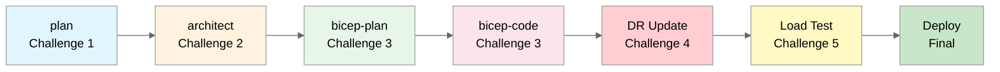

# Agentic InfraOps Hackathon

> **5-Hour Challenge**: Transform business requirements into deployed Azure infrastructure using AI agents.

## Overview

Welcome to the Agentic InfraOps Hackathon! Your team will use GitHub Copilot custom agents to
design, plan, implement, and deploy Azure infrastructure — all guided by AI and aligned with the
Azure Well-Architected Framework.

**What you'll experience:**

- AI-assisted requirements gathering and architecture design
- Automated Bicep code generation from natural language
- Cost estimation using Azure Pricing MCP
- Real deployment to your Azure subscription
- A mid-event "curveball" that tests your adaptability!

## Learning Objectives

By the end of this hackathon, you will:

1. ✅ **Understand agentic workflows** for Infrastructure as Code
2. ✅ **Generate production-ready Bicep** using AI agents
3. ✅ **Apply WAF principles** (Reliability, Security, Cost, Operations, Performance)

## Quick Links

| Document                                                                    | Description                             |
| --------------------------------------------------------------------------- | --------------------------------------- |
| 📅 **[AGENDA](AGENDA.md)**                                                  | **Full schedule with timing**           |
| **Challenges**                                                              |                                         |
| [Challenge 1: Requirements](challenges/challenge-1-requirements.md)         | Gather requirements with **plan** agent |
| [Challenge 2: Architecture](challenges/challenge-2-architecture.md)         | WAF assessment with **architect** agent |
| [Challenge 3: Implementation](challenges/challenge-3-implementation.md)     | Bicep planning and code generation      |
| [Challenge 4: DR Curveball](challenges/challenge-4-dr-curveball.md)         | Multi-region disaster recovery          |
| [Challenge 5: Load Testing](challenges/challenge-5-load-testing.md)         | Validate infrastructure performance     |
| [Challenge 6: Partner Showcase](challenges/challenge-6-partner-showcase.md) | Team presentations                      |
| **Participant Materials**                                                   |                                         |
| [Scenario Brief](participant/scenario-brief.md)                             | Nordic Fresh Foods business challenge   |
| [Pre-Work Checklist](participant/pre-work-checklist.md)                     | Setup before the event                  |
| [Hints & Tips](participant/hints-and-tips.md)                               | Architecture and cost hints             |
| **Facilitator Materials**                                                   |                                         |
| [Facilitator Guide](facilitator/facilitator-guide.md)                       | Detailed schedule and coaching tips     |
| [Scoring Rubric](facilitator/scoring-rubric.md)                             | WAF-aligned evaluation criteria         |
| [Solution Reference](facilitator/solution-reference.md)                     | Expected outputs and patterns           |

## Team Structure

| Aspect             | Details     |
| ------------------ | ----------- |
| Team Size          | 3-4 members |
| Total Participants | 20-24       |
| Teams              | 5-6         |

**Suggested Roles:**

- **Requirements Lead**: Drives the **plan** agent conversation
- **Architect**: Guides **architect** decisions, focuses on WAF
- **Developer**: Leads **bicep-plan** and **bicep-code** sessions
- **Ops Engineer**: Handles deployment and troubleshooting

> 💡 Rotate roles between challenges so everyone experiences each agent!

## Schedule (5 Hours)

| Time | Duration | Block                                                                                                   | Activity                                              |
| ---- | -------- | ------------------------------------------------------------------------------------------------------- | ----------------------------------------------------- |
| 0:00 | 45 min   | **Intro**                                                                                               | Setup verification, workflow overview, team formation |
| 0:45 | 60 min   | **[Challenge 1](challenges/challenge-1-requirements.md)**                                               | Requirements gathering with **plan** agent            |
| 1:45 | 10 min   | _Break_                                                                                                 | ☕                                                    |
| 1:55 | 60 min   | **[Challenge 2](challenges/challenge-2-architecture.md)**                                               | Architecture assessment with **architect** agent      |
| 2:55 | 10 min   | _Break_                                                                                                 | ☕                                                    |
| 3:05 | 60 min   | **[Challenge 3](challenges/challenge-3-implementation.md)**                                             | Bicep planning and code generation                    |
| 4:05 | 10 min   | _Break_                                                                                                 | ☕                                                    |
| 4:15 | 10 min   | **⚡ CURVEBALL**                                                                                        | New requirement announced: Multi-region DR!           |
| 4:25 | 35 min   | **[Challenge 4](challenges/challenge-4-dr-curveball.md) + [5](challenges/challenge-5-load-testing.md)** | DR architecture + Load testing                        |
| 5:00 | —        | **Wrap-up**                                                                                             | Team showcases, automated scoring, next steps         |

> ⚠️ **Staggered Challenge**: At 4:15, facilitators announce new business requirements
> (multi-region DR). This simulates real-world requirement changes!

## The Challenge: Nordic Fresh Foods

See [Scenario Brief](participant/scenario-brief.md) for the full business challenge.

**TL;DR**: A Stockholm-based farm-to-table delivery company needs cloud infrastructure:

1. Capture requirements using the **plan** agent
2. Design a WAF-aligned architecture
3. Generate Bicep templates
4. Deploy to Azure
5. **NEW at 4:15**: Adapt to multi-region DR requirements (the curveball!)
6. Run load tests to validate infrastructure
7. Document the solution

**Constraints:**

| Phase             | Budget      | Regions                | Load      |
| ----------------- | ----------- | ---------------------- | --------- |
| Challenges 1-3    | ~€500/month | `swedencentral`        | 500 users |
| After Challenge 4 | ~€700/month | + `germanywestcentral` | 500 users |

## Scoring

Teams are evaluated on a **100-point scale** aligned with WAF pillars.
See [Scoring Rubric](facilitator/scoring-rubric.md) for full criteria.

**🤖 Automated Scoring**: Facilitators run the scoring script:

```powershell
# Score your team's submission
.\scripts\hackathon\Score-Team.ps1 -TeamName "freshconnect" -ResourceGroupName "rg-freshconnect-dev-swc"

# Display leaderboard
.\scripts\hackathon\Get-Leaderboard.ps1
```

### Bonus Points (up to 25 extra)

| Enhancement                                | Bonus |
| ------------------------------------------ | ----- |
| Zone redundancy                            | +5    |
| Private endpoints                          | +5    |
| Multi-region DR (automated failover)       | +10   |
| Managed identities (no connection strings) | +5    |

## Prerequisites

Complete the [Pre-Work Checklist](participant/pre-work-checklist.md) **before** the event.

## Quick Start (Day of Event)

```bash
# 1. Open the cloned repository
cd azure-agentic-infraops-workshop
code .

# 2. Reopen in Dev Container (F1 → "Dev Containers: Reopen in Container")

# 3. Authenticate with Azure
az login
az account set --subscription "<your-subscription-id>"

# 4. Verify setup
az account show --query "{Name:name, SubscriptionId:id}" -o table
```

## Workflow Reference



---

**Good luck! May your deployments be swift and your drift be minimal.** 🚀
