# Challenges

This folder contains the eight hackathon challenges.

📅 **See [AGENDA.md](../AGENDA.md) for the full schedule with timing.**

| File                                                               | Challenge                     | Points |
| ------------------------------------------------------------------ | ----------------------------- | ------ |
| [challenge-1-requirements.md](challenge-1-requirements.md)         | Requirements Capture          | 20     |
| [challenge-2-architecture.md](challenge-2-architecture.md)         | Architecture Design           | 25     |
| [challenge-3-implementation.md](challenge-3-implementation.md)     | Bicep Implementation          | 25     |
| [challenge-4-dr-curveball.md](challenge-4-dr-curveball.md)         | DR Curveball ⚡               | 10     |
| [challenge-5-load-testing.md](challenge-5-load-testing.md)         | Load Testing                  | 5      |
| [challenge-6-documentation.md](challenge-6-documentation.md)       | Workload Documentation        | 5      |
| [challenge-7-diagnostics.md](challenge-7-diagnostics.md)           | Troubleshooting & Diagnostics | 5      |
| [challenge-8-partner-showcase.md](challenge-8-partner-showcase.md) | Partner Showcase 🎤           | 10     |

**Total**: 105 base points + bonus points available

> **Note**: Challenge 8 focuses on professional communication and presentation skills.

## Challenge Flow

```mermaid
graph LR
    C1[C1: Requirements] --> C2[C2: Architecture]
    C2 --> C3[C3: Bicep]
    C3 --> CB[⚡ CURVEBALL ⚡]
    CB --> C4[C4: DR]
    C4 --> C5[C5: Load Test]
    C5 --> C6[C6: Docs]
    C6 --> C7[C7: Diagnose]
    C7 --> C8[C8: Showcase]
    
    style CB fill:#ff6b6b,color:#fff
    style C8 fill:#0078d4,color:#fff
```

> **Note**: Challenge 4 is announced as a surprise — do not reveal to participants beforehand!
