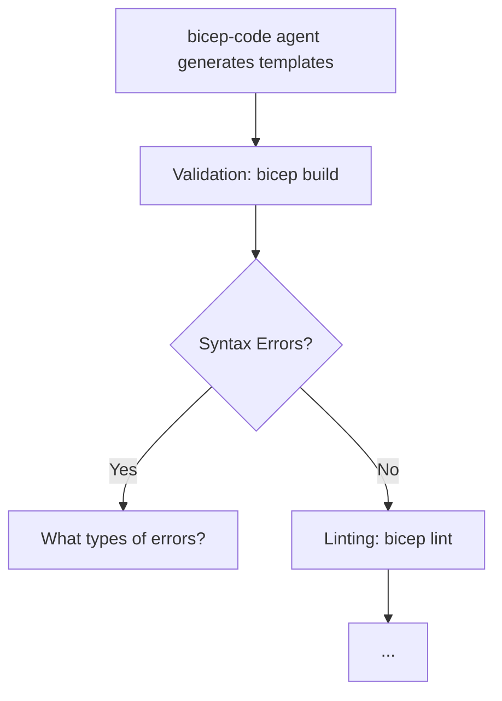

# Challenge 3: Bicep Implementation & Workflow Understanding

> **Duration**: 60 minutes | **Agents**: bicep-plan, bicep-code, deploy | **Output**: Bicep templates + Workflow diagram

## The Business Challenge

Nordic Fresh Foods needs production-ready infrastructure code that:
- Can be deployed repeatedly and consistently
- Meets Azure governance and security requirements
- Is maintainable by their small DevOps team
- Follows infrastructure-as-code best practices

Your task: Generate Bicep templates and **demonstrate you understand the agent workflow** by explaining it.

## Your Challenge

### Part A: Implementation Planning (20 min)

**Your Task**: Use the `bicep-plan` agent to create an implementation strategy.

**Guiding Questions**:
- What information does the agent need from your architecture assessment?
- How should you structure your prompt to get a phased implementation plan?
- What governance constraints might affect your deployment?

**Prompt Engineering Tip**: The agent works best when you provide context about your architecture decisions, not just a file reference.

**Expected Output**: `agent-output/freshconnect/04-implementation-plan.md`

---

### Part B: Code Generation (30 min)

**Your Task**: Use the `bicep-code` agent to generate Infrastructure as Code.

**Consider**:
- How do you describe what you need to the agent?
- What module structure makes sense for this workload?
- How will you handle resource naming to avoid conflicts?

**The Agent Will Generate**:
```
infra/bicep/freshconnect/
├── main.bicep              # Orchestrator
├── main.bicepparam         # Parameters
├── deploy.ps1              # Deployment script
└── modules/                # Modular Bicep files
```

**Your Validation Steps**:
```bash
cd infra/bicep/freshconnect
bicep build main.bicep      # What does this check?
bicep lint main.bicep       # What does this validate?
```

**Questions to Explore**:
- What happens during `bicep build`? What errors would stop you?
- What does `bicep lint` check for? Are all warnings critical?
- How do Azure Policy constraints affect your deployment?

---

### Part C: Understanding the Workflow (10 min) ⭐ REQUIRED

**Critical Deliverable**: Create a Mermaid flowchart that explains the agent-driven deployment workflow.

Your flowchart must show:
1. How the `bicep-code` agent generates templates
2. What happens during validation (`bicep build`)
3. What linting checks for (`bicep lint`)
4. How the `deploy` agent attempts deployment
5. Common errors and how agents adjust
6. The feedback loop when issues are discovered

**Why This Matters**: In your Partner Showcase, you'll need to explain this workflow to demonstrate you understand the process, not just executed commands.

**Save your flowchart** in your presentation materials - you'll need it for Challenge 8.

**Example Structure** (expand this based on your experience):


## Key Concepts to Understand

### Resource Naming Patterns

**Question**: Why do some resources fail to deploy with "name already in use" errors?

**Explore**:
- How do you generate unique names for globally-unique resources?
- What's the pattern for Key Vault names? (Hint: 24 char limit)
- What's the pattern for Storage Account names? (Hint: special rules)

**Snippet for Discovery**:
```bicep
// Concept: Generate a unique suffix per resource group
var uniqueSuffix = uniqueString(resourceGroup().id)

// How would you use this for Key Vault? Storage? SQL?
```

### Required Tags

**Question**: Why do deployments fail with "RequestDisallowedByPolicy" errors about missing tags?

**Explore**:
- What tags are required by your subscription's Azure Policies?
- Where in your Bicep should tags be defined?
- How do you pass tags to modules?

### Security Baseline

**Question**: What security settings cause policy violations if missing?

**Research**:
- Storage accounts: What HTTPS/TLS settings are required?
- SQL: What authentication mode is enforced?
- App Services: What SSL/TLS requirements exist?

**Snippet for Exploration**:
```bicep
// What properties must be set to pass Azure Policy?
properties: {
  supportsHttpsTrafficOnly: ?
  minimumTlsVersion: ?
  allowBlobPublicAccess: ?
}
```

## Success Criteria

| Criterion                                   | Points |
| ------------------------------------------- | ------ |
| Implementation plan created                 | 5      |
| Bicep templates generated                   | 5      |
| Templates compile without errors            | 5      |
| Security baseline requirements understood   | 5      |
| **Workflow diagram created and explained** | 5      |
| **Total**                                   | **25** |

## Coaching Questions

When you encounter issues, ask yourself:

**Naming Conflicts**:
- Q: "My Key Vault deployment failed with 'name already exists'. What now?"
- Consider: How do globally-unique names work in Azure? What makes a good naming strategy?

**Policy Violations**:
- Q: "Why does my deployment fail with 'RequestDisallowedByPolicy'?"
- Consider: What does the error message tell you? How do you discover policy requirements?

**Agent Behavior**:
- Q: "The agent made changes I didn't expect. Why?"
- Consider: What context did you provide? What constraints does the agent know about?

**Validation vs Deployment**:
- Q: "My Bicep lints clean but deployment fails. Why?"
- Consider: What's the difference between syntax validation and runtime deployment?

## Deployment (Optional for this phase)

If time permits, attempt deployment to validate your templates:

```powershell
# Preview what will be created (What-If)
az deployment group what-if \
  --resource-group rg-freshconnect-dev-swc \
  --template-file main.bicep \
  --parameters main.bicepparam
```

**Before deploying, consider**:
- Does the What-If output match your expectations?
- Are there any unexpected changes or deletions?
- Do you understand what each resource does?

## Tips for Success

💡 **Don't memorize patterns** - understand the principles. Why are these patterns used?

💡 **Errors are learning opportunities** - each policy violation teaches you about Azure governance.

💡 **The agent is a collaborator** - if the output isn't what you need, refine your prompt with more context.

💡 **Document your decisions** - your flowchart will help explain your solution in the Partner Showcase.

## Next Step

After templates are validated and you've created your workflow diagram:

⏸️ **Wait for Challenge 4** - The facilitator will announce a business change at 12:40 that will test your agility!

Use any extra time to:
- Refine your Bicep templates
- Explore alternative architectures
- Practice explaining your workflow diagram
- Begin deployment (if confident)
