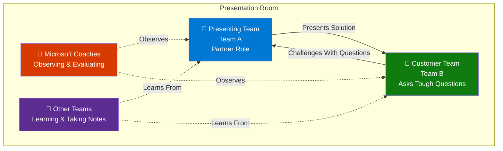

# Challenge 8: Partner Showcase 🎤

> **Duration**: 40 minutes | **Format**: Role-Play Presentations | **Points**: 10

## Overview

This is your moment to shine! Each team will present their FreshConnect solution to a "customer"
(played by another team) while Microsoft coaches observe and provide feedback.

**This challenge simulates a real partner-customer engagement** — the kind you'll experience
when delivering Azure solutions professionally.

## The Setup



## Role Assignments

The coach will pair teams:

| Presenting Team (Partner) | Challenging Team (Customer) |
| ------------------------- | --------------------------- |
| Team 1                    | Team 2                      |
| Team 2                    | Team 3                      |
| Team 3                    | Team 4                      |
| Team 4                    | Team 5                      |
| Team 5                    | Team 6                      |
| Team 6                    | Team 1                      |

> **Note**: When you're the "customer," your job is to ask tough but fair questions!

---

## Presentation Format

**Time per team**: ~6 minutes

| Segment       | Duration | Content                      |
| ------------- | -------- | ---------------------------- |
| Partner Pitch | 4 min    | Present your solution        |
| Customer Q&A  | 2 min    | Customer team asks questions |

---

## What to Present

Your presentation should cover **three key areas**:

### 1. Architecture Overview (2 min)

- What services did you choose and why?
- How does the solution meet the business requirements?
- Show your architecture diagram

### 2. Technical Decisions (2 min)

- Key design decisions (WAF pillars addressed)
- Security & compliance approach
- Scalability and reliability patterns
- How you handled the DR curveball

### 3. Business Value (1 min)

- Cost breakdown and optimization
- How the solution enables Nordic Fresh Foods' growth
- What would you do in Phase 2?

---

## Presentation Template

Use this structure to prepare your presentation (create slides or use markdown):

```markdown
# FreshConnect Azure Solution

## [Your Team Name]

---

## Slide 1: The Challenge

- Nordic Fresh Foods needs a modern platform
- Key requirements: [list 3-4 key requirements]
- Constraints: Budget €700/month, GDPR, 3-month timeline

---

## Slide 2: Our Solution

[Insert your architecture diagram]

**Core Services:**

- Web Tier: [service]
- API Tier: [service]
- Database: [service]
- Storage: [service]

---

## Slide 3: Why These Choices?

| Service     | Why We Chose It                 |
| ----------- | ------------------------------- |
| [Service 1] | [Reason - cost, features, etc.] |
| [Service 2] | [Reason]                        |
| [Service 3] | [Reason]                        |

---

## Slide 4: Security & Compliance

- ✅ GDPR: [how you addressed it]
- ✅ Authentication: [approach]
- ✅ Secrets: [Key Vault usage]
- ✅ Network: [security measures]

---

## Slide 5: Reliability & DR

**Before Curveball:**

- RTO: 4 hours | RPO: 1 hour
- Single region: swedencentral

**After Curveball:**

- RTO: 1 hour | RPO: 15 minutes
- Multi-region: swedencentral + germanywestcentral
- [How you implemented DR]

---

## Slide 6: Cost Breakdown

| Service     | Monthly Cost |
| ----------- | ------------ |
| [Service 1] | €XX          |
| [Service 2] | €XX          |
| [Service 3] | €XX          |
| **Total**   | **€XXX**     |

_Within €700/month budget: ✅_

---

## Slide 7: What We Learned

- Biggest challenge: [what was hard]
- Biggest win: [what worked well]
- If we had more time: [Phase 2 ideas]

---

## Slide 8: Questions?

Thank you for your time!

**Team Members:**

- [Name 1] - [Role]
- [Name 2] - [Role]
- [Name 3] - [Role]
```

---

## Customer Role: Question Bank

**If you're playing the customer**, use these questions to challenge the partner team.
Pick 2-3 questions that are relevant to their presentation.

### Architecture Questions

| Question                                                 | What You're Testing                   |
| -------------------------------------------------------- | ------------------------------------- |
| "Why did you choose [Service A] over [Service B]?"       | Can they justify technical decisions? |
| "How does this scale when we triple our order volume?"   | Did they think about peak season?     |
| "What happens if the primary region goes down?"          | Do they understand DR?                |
| "We might expand to Norway next year. How hard is that?" | Is the architecture extensible?       |

### Security Questions

| Question                                      | What You're Testing     |
| --------------------------------------------- | ----------------------- |
| "How do you protect our customer data?"       | GDPR awareness          |
| "Where are our API keys stored?"              | Secrets management      |
| "Can your developers access production data?" | Access control thinking |
| "What if someone tries to attack our API?"    | Security posture        |

### Cost Questions

| Question                                           | What You're Testing            |
| -------------------------------------------------- | ------------------------------ |
| "This looks expensive. Can we cut costs anywhere?" | Cost optimization awareness    |
| "What happens to the bill during peak season?"     | Understanding of scaling costs |
| "Are there any hidden costs we should know about?" | Transparency                   |
| "What if we need to add more features later?"      | Future cost implications       |

### Operational Questions

| Question                                          | What You're Testing   |
| ------------------------------------------------- | --------------------- |
| "How do we know if something breaks?"             | Monitoring strategy   |
| "Who gets alerted at 3 AM if the site goes down?" | Operational readiness |
| "How do we deploy updates without downtime?"      | Deployment strategy   |
| "What's your backup and restore process?"         | Data protection       |

### Curveball-Specific Questions

| Question                                                 | What You're Testing         |
| -------------------------------------------------------- | --------------------------- |
| "How did you adapt when the DR requirement came in?"     | Agility and problem-solving |
| "Is the DR solution tested or just designed?"            | Practical vs. theoretical   |
| "What would you do differently if you could start over?" | Learning and reflection     |

---

## Tips for Presenters (Partner Role)

✅ **DO:**

- Be confident — you built something real!
- Admit what you didn't finish (honesty wins respect)
- Explain trade-offs, not just decisions
- Use your artifacts (diagrams, Bicep, cost estimates)
- Thank the customer for their questions

❌ **DON'T:**

- Read from slides word-for-word
- Get defensive about questions
- Blame tools or time constraints
- Oversell features you didn't implement
- Go over time (the coach will cut you off!)

---

## Tips for Questioners (Customer Role)

✅ **DO:**

- Ask genuine questions (you might learn something!)
- Challenge assumptions respectfully
- Focus on business outcomes, not just tech
- Pick questions relevant to their presentation

❌ **DON'T:**

- Be hostile or try to "catch" them
- Ask questions just to show off
- Interrupt the presentation
- Ask about things clearly out of scope

---

## Microsoft Feedback Focus

Coaches will provide brief feedback on:

| Area                | What We'll Comment On                                     |
| ------------------- | --------------------------------------------------------- |
| **Clarity**         | Was the solution easy to understand?                      |
| **Justification**   | Were decisions well-reasoned?                             |
| **WAF Alignment**   | Did they address reliability, security, cost, operations? |
| **Professionalism** | How would this land with a real customer?                 |

---

## Success Criteria

This challenge is worth **10 points** and focuses on professional skills:

| Skill                       | Points | What You're Practicing                |
| --------------------------- | ------ | ------------------------------------- |
| **Technical Communication** | 3      | Explaining complex solutions simply   |
| **Customer Engagement**     | 2      | Handling questions under pressure     |
| **Solution Justification**  | 2      | Defending architectural decisions     |
| **Team Collaboration**      | 2      | Presenting as a unified team          |
| **Active Listening**        | 1      | Learning from other teams' approaches |
| **Total**                   | **10** |                                       |

---

## After All Presentations

Once all teams have presented:

1. **Coach shares observations** — common patterns, creative solutions
2. **Open discussion** — what did teams learn from each other?
3. **Celebrate!** — everyone built real Azure infrastructure today

---

## Preparation Checklist

Before presentations begin, ensure you have:

- [ ] Architecture diagram ready to show
- [ ] Key talking points agreed within team
- [ ] One person designated as primary presenter
- [ ] Others ready to answer detailed questions
- [ ] Cost breakdown visible
- [ ] 2-3 questions ready (for when you're the customer)

---

> **Remember**: The best presentations aren't about being perfect — they're about showing
> what you learned and how you solved real problems. Good luck! 🚀
