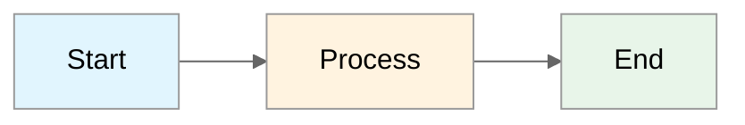

# Workflow Diagram Generator

Generate animated workflow diagrams from Mermaid files in multiple formats (PNG, SVG, GIF, MP4).

## Features

- 📊 **Static PNG** - High-quality raster image for documentation
- 🎨 **Animated SVG** - Vector image with CSS animations for web embedding
- 🎬 **MP4 Video** - Smooth video animation with frame-by-frame rendering
- 🔄 **Animated GIF** - Optimized GIF for README files and presentations
- 📦 **ZIP Package** - All outputs bundled for easy distribution

## Prerequisites

- **Node.js** 18+ (included in Dev Container)
- **FFmpeg** (for GIF/MP4 generation)

```bash
# Install FFmpeg (if not available)
# Ubuntu/Debian
sudo apt-get install ffmpeg

# macOS
brew install ffmpeg
```

## Installation

```bash
cd scripts/workflow-generator
npm install
```

## Usage

### Generate All Outputs

```bash
npm run generate
```

This creates:

- `output/workflow.png` - Static PNG image
- `output/workflow.svg` - Animated SVG with CSS transitions
- `output/workflow.mp4` - MP4 video animation
- `output/workflow.gif` - Optimized animated GIF
- `output/workflow-package.zip` - All files bundled

### Generate Specific Formats

```bash
# PNG only
npm run generate:png

# SVG only (with animations)
npm run generate:svg

# GIF only
npm run generate:gif
```

### Clean Output Directory

```bash
npm run clean
```

## Configuration

Edit `generate-workflow.js` to customize:

```javascript
const CONFIG = {
  inputFile: "workflow.mmd", // Input Mermaid file
  outputDir: "output", // Output directory
  animationDelay: 1200, // ms per node animation
  width: 1200, // Output width
  height: 600, // Output height
  theme: "neutral", // Mermaid theme
};
```

## Input Format

The input file (`workflow.mmd`) should contain valid Mermaid syntax:



## SVG Animation

The generated SVG includes CSS animations:

- **Fade-in**: Nodes appear with a fade and slide effect
- **Draw-line**: Edges animate with a drawing effect
- **Pulse**: Optional integrations pulse subtly
- **Staggered timing**: Elements appear sequentially

To use the animated SVG in a webpage:

```html

<!-- or -->
<object type="image/svg+xml" data="workflow.svg"></object>
```

## GIF Optimization

The GIF is generated using a two-pass encoding process:

1. **Palette generation** - Creates an optimized color palette
2. **Dithering** - Applies Bayer dithering for smooth gradients

This results in smaller file sizes with better quality.

## Troubleshooting

### "Mermaid CLI not found"

```bash
npm install @mermaid-js/mermaid-cli
```

### "FFmpeg not found"

Install FFmpeg for your platform:

```bash
# Ubuntu/Debian
sudo apt-get install ffmpeg

# macOS
brew install ffmpeg

# Windows (via chocolatey)
choco install ffmpeg
```

### Puppeteer errors in containers

The script includes sandbox flags for containerized environments. If you still
have issues, ensure Chrome/Chromium is installed:

```bash
npx puppeteer browsers install chrome
```

## Output Examples

After running `npm run generate`:

```
output/
├── workflow.png           # 1200x600 PNG
├── workflow.svg           # Animated SVG
├── workflow.mp4           # ~3 second video
├── workflow.gif           # Optimized GIF
└── workflow-package.zip   # All files bundled
```

## Integration with README

To use the generated GIF in the main README:

```markdown

```

Or reference the SVG for animation support:

```markdown

```

## License

MIT
